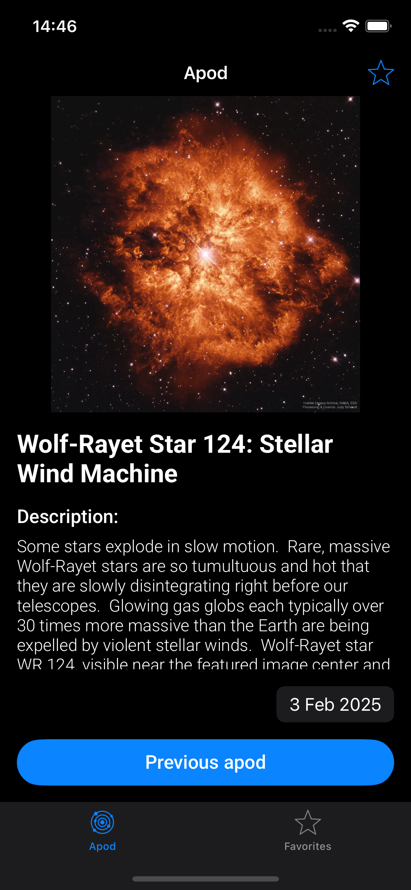
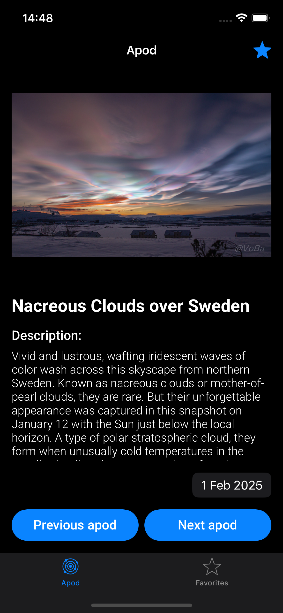
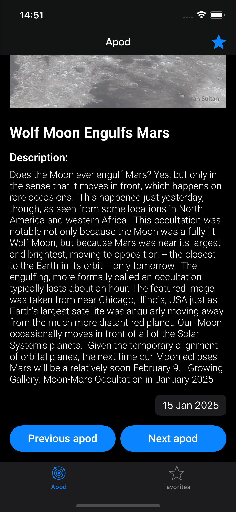
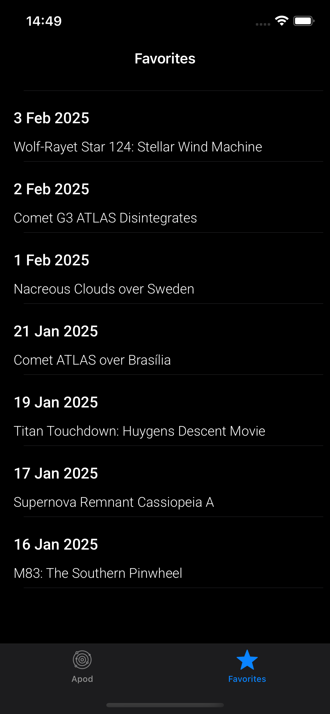

# 🚀 APOD APP

The **Apod APP** is a friendly and intuitive application that presents you with the astronomical picture of a specific day based on data provided by the NASA API.

  
  
  
  

## 🔍 Features

### 🏠 Main Screen (Apod)
Upon opening the app, the current day's astronomical image is displayed along with its title, description, and date. The following actions are available:

- **View previous Apod:** Allows viewing the Apod from the previous day. This action is triggered by clicking the *"Previous Apod"* button.
- **View next Apod:** Allows viewing the Apod for the next day. This action is triggered by clicking the *"Next Apod"* button. (Note: This button is not displayed when the Apod being shown is the current day's Apod).
- **View specific date Apod:** Allows selecting a specific date and viewing the corresponding Apod information. This action is triggered by clicking on the date and selecting it from the calendar.
- **Favorite Apod:** Allows saving Apod data for easier access through the favorites screen. This action is triggered by clicking the favorite button (star).

### 🌟 Favorites Screen

- **View favorite Apods:** Displays a list of Apods marked as favorites. This action is triggered by clicking the favorites button (star) in the navigation bar.
- **View favorite Apod:** Displays information about a favorite Apod when selected from the favorites list.

## ⚠️ Exceptions

- **Error loading Apod:** Displays an error message when the API fails to return the Apod. Allows viewing the previous Apod from this screen.
- **Empty favorites list:** Displays a message informing that there are no favorites to be shown.

## 🛠️ Technologies

- **Language:** [Swift](https://developer.apple.com/swift/)
- **Framework:** [UIKit](https://developer.apple.com/documentation/uikit/)
- **API:** [NASA APOD](https://api.nasa.gov/)

## 🏗️ Architecture
The **VIP** architecture is used with the following layers:
- **Repository:** Intermediates communication between data sources (API and UserDefaults) and the application.
- **Interactor:** Handles the application's business logic.
- **Presenter:** Defines how data will be presented on the view.
- **View:** Responsible for displaying the screens and visual elements such as buttons, images, and text.

## 📦 Frameworks

Dependencies were installed using using [Swift Package Manager (SPM)](https://developer.apple.com/documentation/xcode/swift-packages):

- **Alamofire** – Library for HTTP network requests.  
  Link: [Alamofire](https://github.com/Alamofire/Alamofire)
  
- **Kingfisher** – Library for image download and caching.  
  Link: [Kingfisher](https://github.com/onevcat/Kingfisher)
  
- **YouTube iOS Player Helper** – Library for YouTube video playback.  
  Link: [YouTube iOS Player Helper](https://github.com/youtube/youtube-ios-player-helper)
  
- **Snapshot Testing** – Library for Snapshot testing.  
  Link: [Snapshot Testing](https://github.com/pointfreeco/swift-snapshot-testing)

## 📝 Instructions for Snapshot Testing:
- **Device:** iPhone 13 Pro
- **Mode:** Light Mode

## 🎥 Demo

  

    <h3>Dark Mode</h3>
    
  

  

    <h3>Light Mode</h3>
    
  

---
